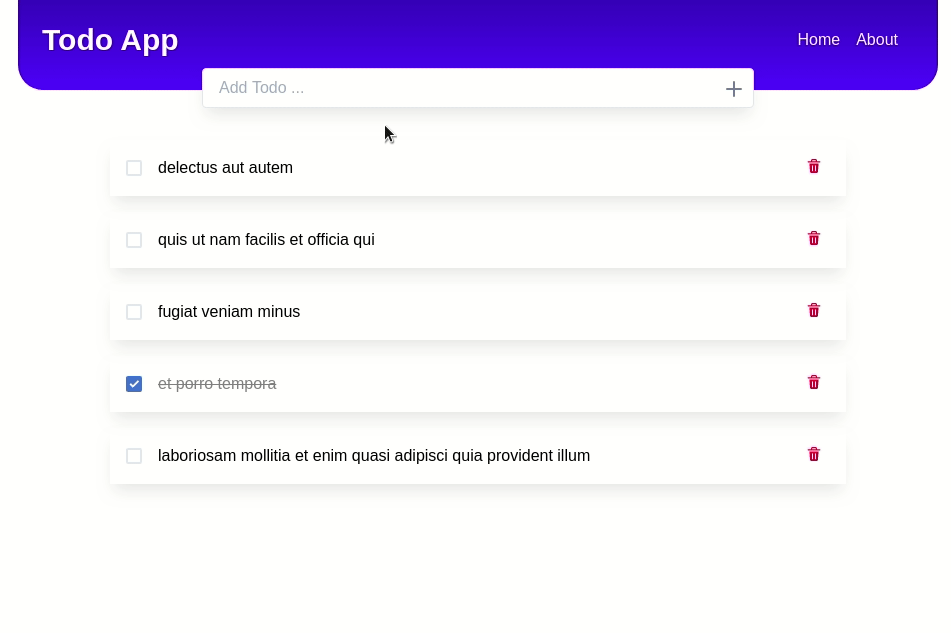

<!-- PROJECT LOGO -->
<p align="center">
    
  <h3 align="center">TodoApp</h3>
  <p align="center">
    a Todo List app built with ReactJS
  </p>
</p>

**Table of Contents**

- [About The Project](#about-the-project)
  - [Built With](#built-with)
- [Getting Started](#getting-started)
  - [Prerequisites](#prerequisites)
- [Usage](#usage)
- [Acknowledgements](#acknowledgements)


## About The Project

A simple Todo List application with basic features

- add a new Todo
- mark a Todo as complete
- delete a Todo



### Built With

- [ReactJs](https://reactjs.org/)
- [json-server](https://github.com/typicode/json-server)
- [ChakraUI](https://chakra-ui.com/)

## Getting Started

### Prerequisites

- Docker
- docker-compose

Follow [this guide](https://docs.docker.com/compose/install/) to learn how to install them

## Usage

- just use the following command to get the application to start

```sh
make
```

<!-- ACKNOWLEDGEMENTS -->
## Acknowledgements

- Logo made by [Freepik]("https://www.flaticon.com/authors/freepik")
