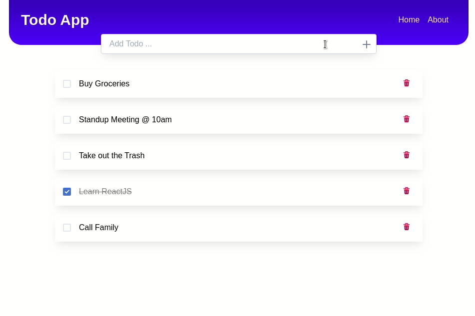
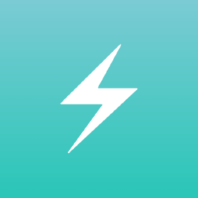

<!-- PROJECT LOGO -->
<p align="center">
    
  <h3 align="center">TodoApp</h3>
  <p align="center">
    a Todo List app built with ReactJS
  </p>
</p>

**Table of Contents**

- [About The Project](#about-the-project)
- [Usage](#usage)
  - [Prerequisites](#prerequisites)
  - [Installation](#installation)
- [Acknowledgements](#acknowledgements)

## About The Project

  

Features:

- Built using [ReactJs](https://reactjs.org/) 
- Interaction with backend using [Axios](https://github.com/axios/axios)
- Mocked backend server using [json-server](https://github.com/typicode/json-server) 
- [ChakraUI](https://chakra-ui.com/) as the components library 
- Fully dockerized 

Functionality:

- add a new Todo
- mark a Todo as complete
- delete a Todo


## Usage

### Prerequisites

- Docker
- docker-compose

Follow [this guide](https://docs.docker.com/compose/install/) to learn how to install them

### Installation

- just use the following command to get the application to start

```sh
 docker-compose -f docker-compose.local.yml up --build
 ```

## Acknowledgements

- Logo made by [Freepik]("https://www.flaticon.com/authors/freepik")
